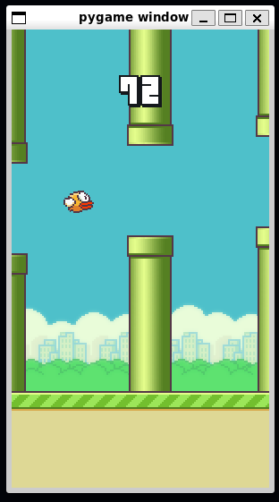
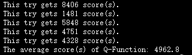

# 游卡桌游算法岗入职前学习任务  
## 问题背景与概述  
Flappy Bird曾是一款风靡全球的简单游戏，因为其难以操控和简单的重开成本吸引了不少玩家。  
因为这个游戏本身的规则简单，评价标准比较单一，可以作为强化学习的目标。  
  
## 数据收集与获取  
human_play.py 会调用pygame里的Flappy Bird，其中会返回游戏的运行参数  
## 算法设计  
采用Q-Learning算法，这是一种经典的值函数算法，使用迭代公式构建（状态，行动）到（值）的公式  
## 模型抽象  
从游戏中输入以下参数转换后用来描述状态  
```
    obs[0]: the last pipe's horizontal position
    obs[1]: the last top pipe's vertical position
    obs[2]: the last bottom pipe's vertical position
    obs[3]: the next pipe's horizontal position
    obs[4]: the next top pipe's vertical position
    obs[5]: the next bottom pipe's vertical position
    obs[6]: the next next pipe's horizontal position
    obs[7]: the next next top pipe's vertical position
    obs[8]: the next next bottom pipe's vertical position
    obs[9]: player's vertical position
    obs[10]: player's vertical velocity
    obs[11]: player's rotation
```  
接收以下参数作为估值  
```
    reward
    """
    -0.5，因撞地游戏失败，映射到value里面是估值-500
    -1，因撞管失败，映射到value里面是估值-500
    1，通过一根管道，映射到value里面是估值+50
    0.1，存活，不影响value
    """
```
最后通过公式  
$Q[s,a] ← Q[s,a] + α (r + γ*V(s’) - Q[s,a])$  
迭代  
## 代码实际编写  
请参见代码注释  
## 模型调优  
  
最好结果4962.8分  
## 应用及优化建议  
三国杀移动版里面也有南华老仙玩flappy bird，目前AI会放弃玩小游戏，这也是可以应用的地方。  
目前考虑到flappy bird游戏简单，时间充裕，采用了  
$\alpha=0.5$  
$\gamma=0.98$  
$ε=0$  
## 运行方法  
Python版本为3.11。  
训练模型：  
```
python train_ai_or_play.py --train
```
测试模型：
```
python train_ai_or_play.py --no-train
```
## 说明  
现训练时不会同步进行测试，以找到当前参数下的最佳迭代次数。若不需要测试可以在q_learning.py中注释掉测试代码，可以提高训练速度：  
```
# 定期测试
        if (i+1) % 1 == 0:
            avg_score = test_model(player)
            if avg_score > best_avg_score:
                best_avg_score = avg_score
                print(f"Iteration {i+1}, Average Test Score: {avg_score}")
                best_iteration = i + 1
                best_player = pickle.loads(pickle.dumps(player))  # 深拷贝当前最好的模型
```
同时，测试代码部分也关闭了动画渲染，若需要观看AI玩Flappy Bird时的动画，可以在q_learning.py中改变render模式：  
```
# 渲染模式为None可以跳过动画，"human"为显示动画
def play(ai, audio_on=False, render_mode=None, use_lidar=False):
```